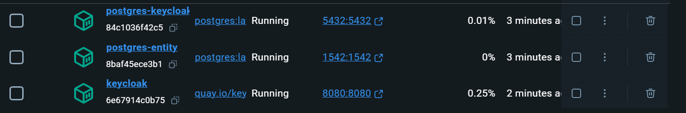

# Проект "Статистический контент Faktura"

### Примечание

Если добавится новый банк или уйдет существующий, то будет необходима задача на добавление данного банка в проект или соответствующее его удаление из проекта.

### Запуск Keycloak и БД
```angular2html
docker compose up
```
Должно появится 3 контейнера


### Для запуска бекенда

Нужно перейти в ./backend и запустить с idea

### Включение и выключение различных компонент

Чтобы включить или выключить определенную компоненту нужно перейти в 
``backend/src/main/resources/application.yml``

```yml
feature-flags:
  components:
    stories: true #истории (добавление, вывод, создание, редактирование)
    show_story: false #добавление примерного вида истории
    banners: true #Банеры
    admin_panel: true #Панель для администратора
```

### Изменение пути для сохранения файлов

Нужно перейти в ``backend/src/main/resources/application.yml``

```yml
file_path_to_save:
  stories: "src/main/resources/static/site/share/htdoc/_files/skins/mobws_story/"
  banners: "src/main/resources/static/site/share/htdoc/_files/skins/mobws_banners/"
```

